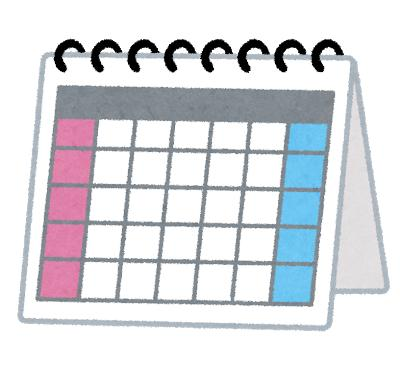

こんにちは。しんやです。

GAS（Google Apps Script）でうるう年判定と日数判定をしながらカレンダー作成するコードを書いたので共有します。

職場で勤怠シートを作成することを想定して開発しました。



```
function myFunction() {

  Logger.log('*** myFunction Start ***');

  //スプレッドシートAppを呼び出し
  var ss = SpreadsheetApp.getActiveSpreadsheet();

  Logger.log('ss:'+ ss);

  //アクティブセルを取得
  var myCell = ss.getActiveCell();

  Logger.log('myCell:' + myCell);
  Logger.log('myCell.getRow():' + myCell.getRow());

  //「年」または「月」が変更されたとき
  if(myCell.getRow()==1 || myCell.getRow()==2) {
  
    //呼び出し
    createCallendar(ss);
  }
  Logger.log('*** myFunction End ***');
}

function createCallendar(ss) {

  Logger.log('*** createCallendar() Start ***');

  //年を取得
  var year = ss.getRange("A1").getValue();
  
  //うるう年判定
  var uruFlg = false;
  if (year % 4 == 0) {
    uruFlg = true;
  } else if (year % 400 == 0) {
    uruFlg = true;
  } else if (year % 100 == 0) {
    uruFlg = false;
  }

  Logger.log('year: ' + year);

  //月を取得
  var month = ss.getRange("A2").getValue();

  Logger.log('month:' + month);

  //日数判定しセット
  var lastDate;
  switch (month) {
    case 1:
    case 3:
    case 5:
    case 7: 
    case 8:
    case 10:
    case 12:
      lastDate = 31;
      break;
    case 4:
    case 6:
    case 9:
    case 11:
      lastDate = 30;
      break;
    case 2:
      lastDate = 28;
      break;
  }

  //うるう年の2月のとき、29日までセット
  if (uruFlg == true && month == 2) {
    lastDate = 29;
  }

  Logger.log('lastDate:' + lastDate);

  //タイトル行をセット
  var titleRow = 7;

  //日にちを消去
  ss.getActiveSheet().getRange("A8:A38").clearContent();

  //日にちを入力
  for (var i = titleRow + 1; i <= titleRow + lastDate; i++) {
    ss.getActiveSheet().getRange(i, 1).setValue(i - titleRow);
  }

  Logger.log('*** createCallendar() End ***');

}
```

以下の処理を実現するのに苦労したので、開発メモとしてたくさんの人に参考にしていただけると嬉しいです。

*   アクティブなスプレッドシートの取得（ファイルとしてアクティブなスプレッドシートの取得）
*   アクティブシートの取得（ワークシートとしてアクティブなシート）
*   アクティブシートの取得（ワークシートとしてアクティブなシート）
*   Switch文で複数条件が真のときの書き方
*   Switch文で複数条件が真のときの書き方

ではまた。

【募集】  
初心者限定で、メンターとしてプログラミングを教えます。  
ぜひ、チェックしてください。  
①時間単位：[https://www.timeticket.jp/items/122081/](https://www.timeticket.jp/items/122081/)  
②1ヶ月単位：[https://www.timeticket.jp/items/122104/](https://www.timeticket.jp/items/122104/)

  
【詳細】  
プログラミングのメンターについて詳しくは公式LINEまで。  
LINEの友だちになると、簡単にメッセージが送れます。  
お気軽にお問い合わせください。

[](https://lin.ee/b3ZBWt5)
