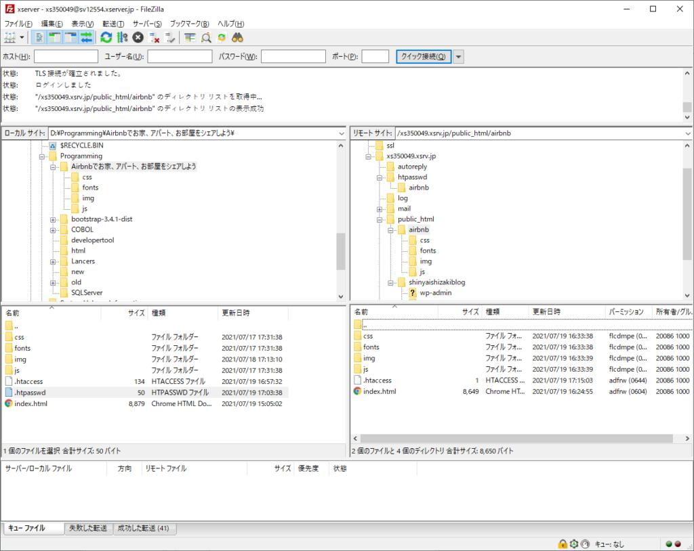
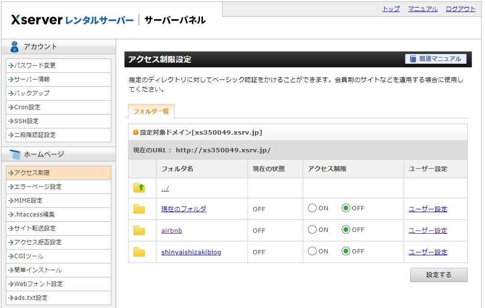
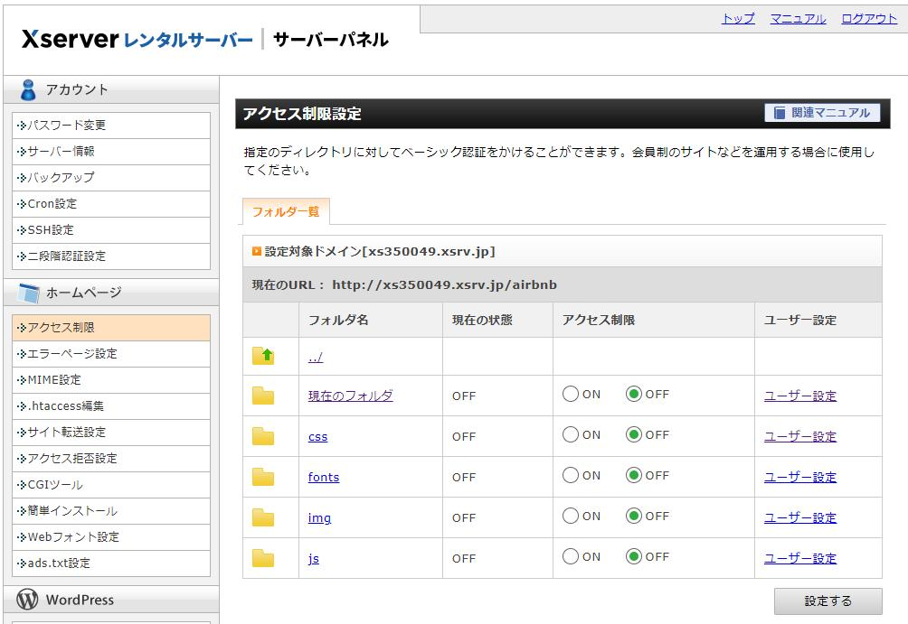
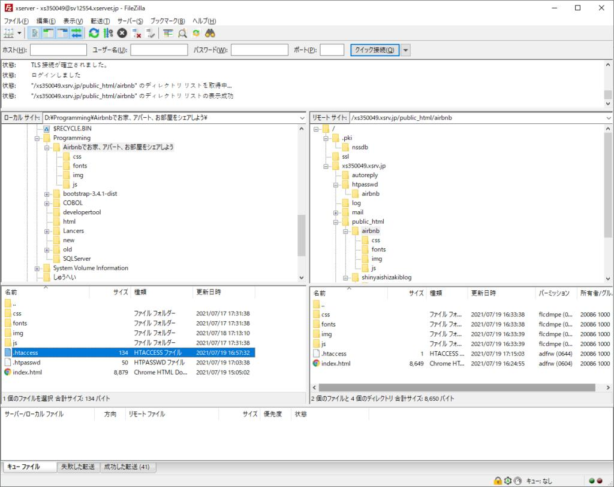
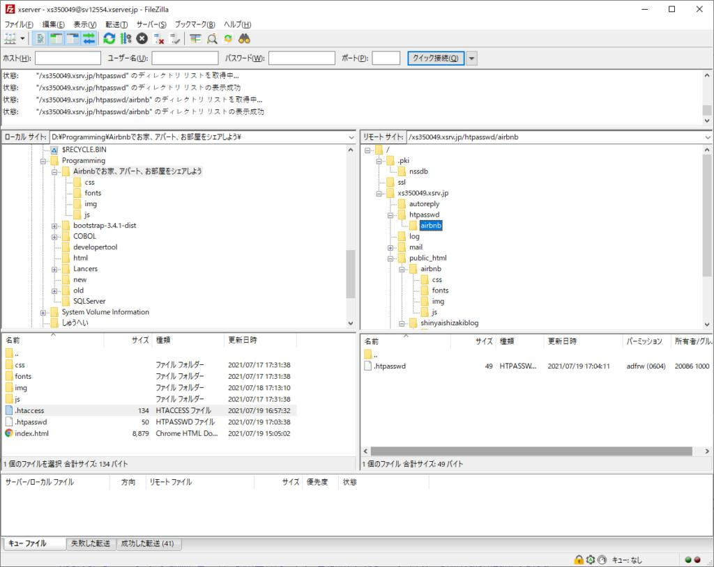

こんにちはしんやです。  
  
manablogの学習課題（https://manablog.org/code-life-start/）に取り組み、ベーシック認証をつけて公開しました。  
  
ベーシック認証の設定について、説明したブログが点在していて公開まで2時間もかかってしまったので、1か所に纏めることにしました。

https://twitter.com/Shinyaaah0311/status/1417039666864279559?s=20

##   
手順1　FileZillaでHTML、CSSファイルをアップロードする



[FileZilla](https://filezilla-project.org/)を使い、ローカルで開発したファイルの配置を崩さないよう注意してHTML、CSSファイルをサーバーへアップロードします。  
  

## 手順2　Xserverでアクセス制限をOFFにする





[Xserverのサーバーパネル画面](https://www.xserver.ne.jp/login_server.php)にあるメニューから「アクセス制限」を選び、親ディレクトリ、子ディレクトリともにアクセス制限を「OFF」にします。

##   
手順3　.htaccess、.htpasswdファイルをアップロードする

「.htaccess」ファイルを以下の通り作成します。

```
AuthUserFile "/home/xs350049/xs350049.xsrv.jp/htpasswd/airbnb/.htpasswd"
AuthName "Member Site"
AuthType BASIC
require valid-user
```

「.htpasswd」ファイルを以下の通り作成します。

※パスワードは[こちら](https://www.luft.co.jp/cgi/htpasswd.php)で暗号化してください。

```
[shinyaishizaki]: [shinyaishizaki:暗号化したパスワード]
```

  
.htaccessはindex.htmlと同じディレクトリに配置します。



htpasswdファイルはサーバー名フォルダ下のhtpasswdフォルダに（例：/xs350049.xsrv.jp/htpasswd/airbnb）に配置します。

.htaccessファイル内の記述と一致していることを確認してください。



  
これで設定は完了です。

アップロードしたページにアクセスして認証を通り、ページが表示されることが確認できます。

お疲れさまでした。
